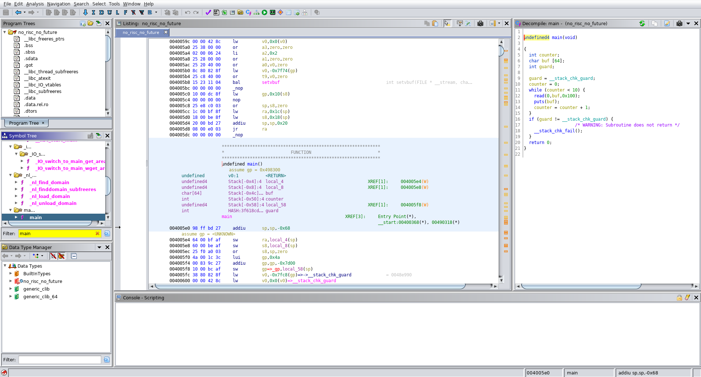
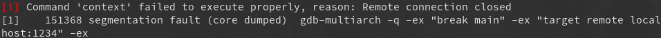

# $ whoami

- Thomas Gschwantner, aka Tharre
- <https://github.com/Tharre>

# Challenge

- hack.lu CTF 2019

- ``We use microcontrollers to automate and conserve energy. IoT and stuff. Most of
them don't use CISC architectures.  Let's start learning another architecture today!``

- Solved: 61

# Demo

- "Provide an overview of the intended functionalities of the application"

# Ghidra time!



# Code

```c
undefined4 main(void) {
  int counter = 0;
  char buf[64];
  int guard = __stack_chk_guard;

  while (counter < 10) {
    read(0, buf, 0x100);
    puts(buf);
    counter = counter + 1;
  }
  // ...
```

# Expoit idea 1

- Write something 9x
- Guess address of buf
- Then write shellcode and overwrite return address
- Profit?

# Try breaking it

# Stack guard

```c
undefined4 main(void) {
  // ...

  if (guard != __stack_chk_guard)
    /* WARNING: Subroutine does not return */
    __stack_chk_fail();

  return 0;
}
```

# Exploit idea 2

- Leak guard variable
- Write something 9x
- Guess address of shellcode and overwrite return address
- Profit?

# MIPS crash course

- a0-a4 stores arguments
- v0-v1 stores results
- simple, straightforward and all we really care about

# Roadblock 1

- At this point we'd like to do some testing with gdb
- However ...

# GDB crashes anyone? (Demo)



# Recovering guard

- c strings are \0 terminated
- so leak one byte at a time via puts()

# Roadblock 2

- In theory, we should now have everything we need for a working exploit
- But, only works locally, not remotely
- Return address wrong?

# ASLR

- no ASLR (yay!) (checksec)
- but offsets still vary quite a bit
- good practise to also leak a stack ptr

# Demo: finished exploit

# Flag

flag{indeed_there_will_be_no_future_without_risc}

# Discussion & Countermeasures

- use WireGuard! <https://www.wireguard.com/>
- no wait, wrong slide


# Discussion & Countermeasures

- ASLR & RELRO
- NX
- but also: maybe don't write everything in C?

# Thanks!
